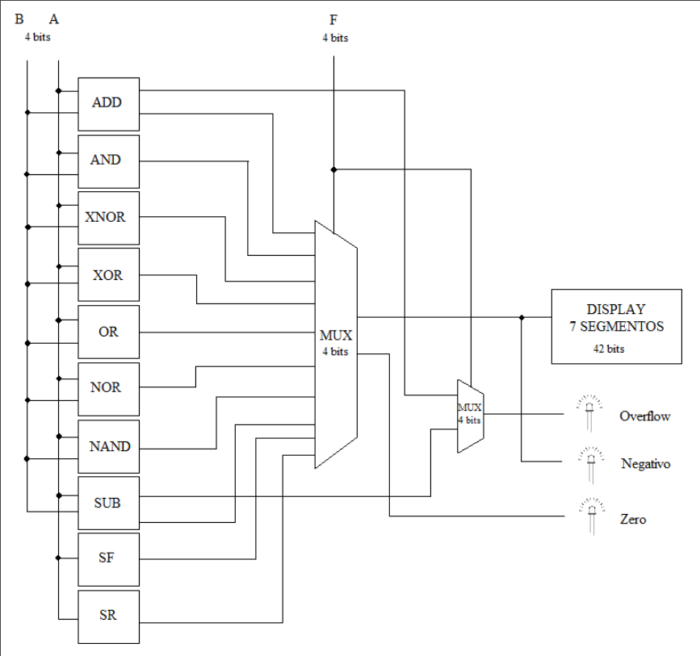
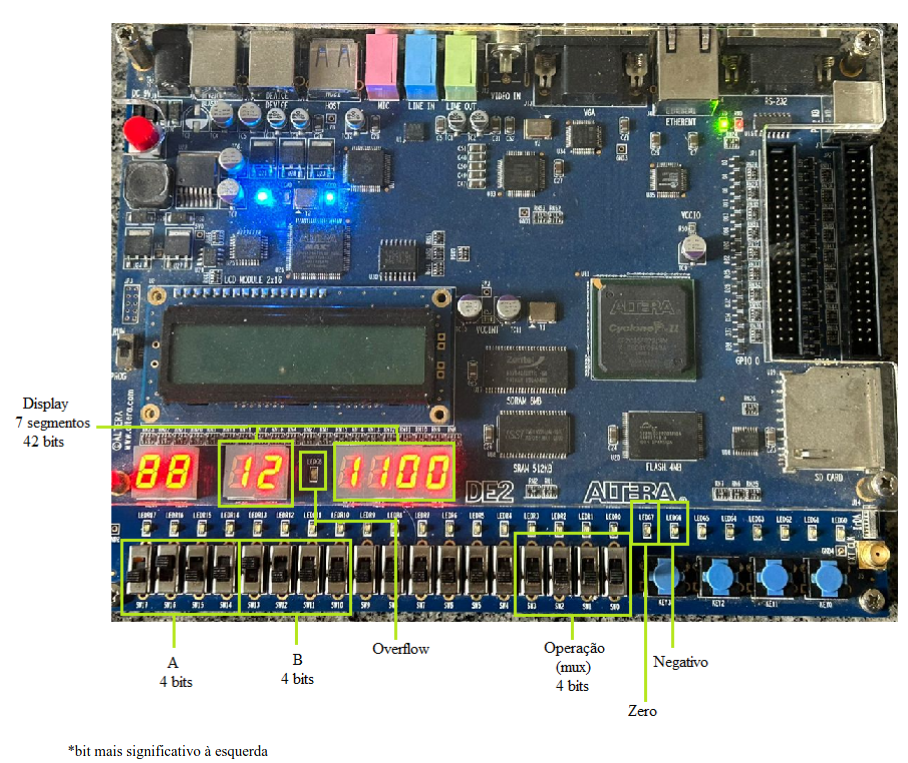
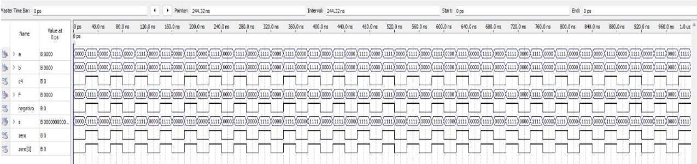

# 4-bit Arithmetic Logical Unit

##### 4-bit Arithmetic Logic Unit architected for the EP2C35F672C6 FPGA device for "Tećnicas Digitais" course at Federal University of Pelotas made by Guilherme Ganassini, Gustavo Domenech and Lorenzo Baldissera
----------------------------------------------------------------------------------

## Architecture

### Components

#### 4-Bit Adder (somador4bits):

Performs addition of two 4-bit operands (a and b). Produces a 4-bit sum (sinal0) and an overflow signal (sinaloverflow).

#### Logic Operations (and_func, xnor_func, xor_func, or_func, nor_func, nand_func):

Executes various logic operations (AND, XNOR, XOR, OR, NOR, NAND) between the 4-bit operands a and b. Outputs the results of these operations (sinal1 to sinal6).

#### Shifters (shift_left, shift_right):

Performs left and right shift operations on the 4-bit operand a. Outputs the shifted results (sinal8 and sinal9).

#### 4-Bit Subtractor (subtrator4bits):
Subtracts the operand b from the operand a. Outputs the 4-bit difference (sinal7).

#### 16-to-1 Multiplexer (mux16_1):
Selects one of the 16 input signals based on the 4-bit control vector F. Outputs the selected operation result (entrada_seg7).

#### Overflow Multiplexer (mux_overflow):
Selects one of the input signals based on the overflow condition (sinaloverflow). Determines whether the carry output signal (c4) should be activated based on the selected operation (F). It was implemented to fix an overflow issue in the subtraction operation.

#### 7-Segment Display Converter (seg7):
Converts the selected operation result (entrada_seg7) into 7-segment display signals for visualization. Detects zero and negative outputs.

----------------------------------------------------------------------------------
## EP2C35F672C6 Input/Output map

----------------------------------------------------------------------------------

## Waveform results

